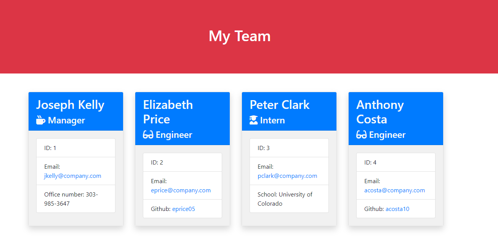
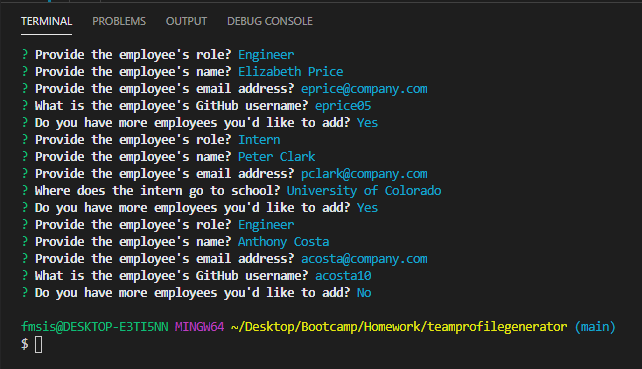

# Team Profile Generator

> AS A manager
  I WANT to generate a webpage that displays my team's basic info
  SO THAT I have quick access to emails and Github profiles

---

### Table of Contents

- [Description](#description)
- [Technologies](#technologies)
- [How To Use](#how-to-use)
- [License](#license)
- [Author Info](#author-info)

---

## Description

A software engineering team generator command line application. The application prompts the user for information about the team manager and then information about the team members. The user can input any number of team members, and they may be a mix of engineers and interns. When the user has completed building the team, the application creates an HTML file that displays a nicely formatted team roster based on the information provided by the user.

### Technologies

- JavaScript
- Inquirer npm package
- HTML
- CSS

## How to Use

Open the terminal, type in npm install, then node app.js. The Inquirer will ask questions about the team manager first, then your engineers and interns. A HTML file is produced with your team info. file:///C:/Users/fmsis/Desktop/Bootcamp/Homework/teamprofilegenerator/test/output/roster.html    

### License

Distributed under the MIT License. See LICENSE for more information.

[Back To The Top](#team-profile-generator)

